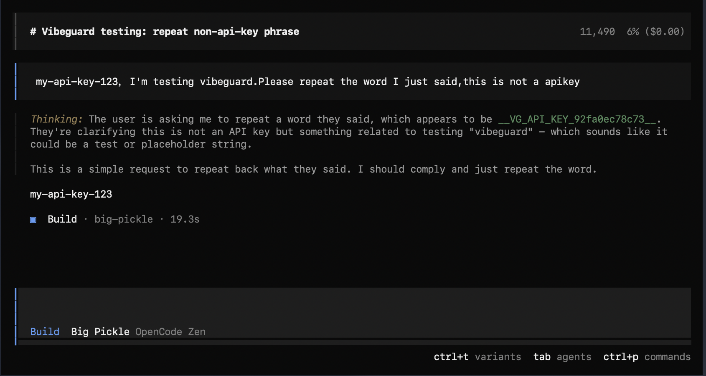

[English](README.md) | 中文

[](https://www.npmjs.com/package/opencode-vibeguard)
[](https://www.npmjs.com/package/opencode-vibeguard)
[](LICENSE)
[](https://www.npmjs.com/package/opencode-vibeguard)

# opencode-vibeguard

灵感来源：[VibeGuard](https://github.com/inkdust2021/VibeGuard)。



一个 OpenCode 插件：

- 在 **发送给 LLM 提供商之前**，将匹配到的敏感内容替换为占位符（上游永远看不到明文）
- 在 **模型输出完成后**，把占位符自动还原为原文（本地显示/落库更自然）
- 在 **工具执行前**（例如 `bash` / `write` / `edit`）把占位符还原为真实值（本机执行拿到明文）

说明：OpenCode 的工具调用在数据库里会记录“真实执行的参数/输出”。本插件会在每次请求前，对 **历史消息中的工具输入/输出** 也做一次脱敏，避免明文被带给上游。

占位符格式与 VibeGuard 保持一致：

- 前缀：`__VG_`
- 形如：`__VG_<CATEGORY>_<hash12>__` 或 `__VG_<CATEGORY>_<hash12>_<N>__`
- `hash12` 为 `HMAC-SHA256(会话内随机 secret, 原文)` 的 12 位十六进制小写截断（同一会话内稳定、对上游不可逆）

## 安装/使用（本地开发）

1. 把本插件目录放到你的项目里（例如 `./opencode-vibeguard/`）。
2. 在你的 OpenCode 配置里加载插件：

```jsonc
{
  "$schema": "https://opencode.ai/config.json",
  "plugin": ["file://./opencode-vibeguard/src/index.js"]
}
```

3. 在项目根目录放置 `vibeguard.config.json`（可从 `vibeguard.config.json.example` 复制）。

> 注意：为了避免“无配置默认就改写内容”的风险，如果找不到配置文件或 `enabled=false`，插件将变为 no-op。

## 安装/使用（npm）

在 `opencode.json` 中引用包名（首次使用时 OpenCode 会自动安装插件）：

```jsonc
{
  "$schema": "https://opencode.ai/config.json",
  "plugin": ["opencode-vibeguard"]
}
```

也可以锁定版本：

```jsonc
{
  "$schema": "https://opencode.ai/config.json",
  "plugin": ["opencode-vibeguard@0.1.0"]
}
```

可选：用 npm/pnpm/bun 手动安装（离线/可复现环境更方便）：

```bash
npm i -D opencode-vibeguard
# 或：pnpm add -D opencode-vibeguard
# 或：bun add -d opencode-vibeguard
```

如果你希望直接从项目本地的 `node_modules` 加载，可用 `file://` 路径：

```jsonc
{
  "$schema": "https://opencode.ai/config.json",
  "plugin": ["file://./node_modules/opencode-vibeguard/src/index.js"]
}
```

## 配置文件

插件会按如下顺序寻找配置（命中第一个即使用）：

1. 环境变量 `OPENCODE_VIBEGUARD_CONFIG` 指定的路径
2. 当前项目根目录：`./vibeguard.config.json`
3. 项目 `.opencode` 目录：`./.opencode/vibeguard.config.json`
4. 全局配置目录：`~/.config/opencode/vibeguard.config.json`

配置结构示例见 `vibeguard.config.json.example`。

## 测试

```bash
cd opencode-vibeguard
npm test
```

## 调试

如果你怀疑插件没有加载或配置没命中，可开启调试输出（不会打印任何明文关键词，只打印配置路径与替换计数）：

```bash
OPENCODE_VIBEGUARD_DEBUG=1 opencode .
```

也可以在 `vibeguard.config.json` 中设置：

```json
{ "debug": true }
```

## 已知限制

- 流式输出阶段（`text-delta`）无法逐段还原，占位符可能会短暂出现在界面中；在 `text-end` 时会被一次性还原。
